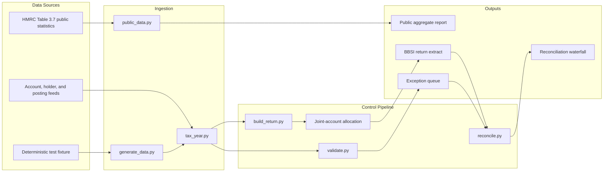

<div align="center">

<!-- Replace with a branded SVG or PNG when available. -->


# UK BBSI Tax Reporting Pipeline

### Extract. Validate. Reconcile. Never plug a difference.

[](https://github.com/jumma786/uk-bbsi-tax-reporting-pipeline)
[](#verification)
[](#license)
[](#developer-workflow)
[](requirements.txt)

[Demo](#interactive-demo) · [Documentation](#architecture) · [Report Bug](https://github.com/jumma786/uk-bbsi-tax-reporting-pipeline/issues/new) · [Request Feature](https://github.com/jumma786/uk-bbsi-tax-reporting-pipeline/issues/new)

</div>

> [!IMPORTANT]
> The public report uses official HMRC aggregate statistics. The granular holders, accounts, and postings are deterministic synthetic fixtures used only to test controls; no real names, NINOs, or bank records are included.

## Executive Summary

This repository models the assurance layer around a UK Bank and Building Society Interest (BBSI) return. It focuses on the controls that determine whether an extract is trustworthy before anyone files it: date boundaries, identity completeness, joint-account allocation, exception severity, and ledger reconciliation.

| Reliability | Operational Control | Developer Experience |
|---|---|---|
| Tax-year filtering and balanced reconciliation | Blocking versus advisory exception queues | Python pipeline, SQL parity, deterministic tests |
| Joint-account allocations sum back to source | Every exclusion is named and quantified | One-command HMRC public-data report |
| Material breaks cannot be hidden by tolerance | ISA interest is explicitly held back | Clear outputs under `output/` |

## Key Capabilities

- **Tax-year correctness:** Applies the UK 6 April to 5 April boundary without silently dropping out-of-period postings.
- **Structural NINO validation:** Detects values that cannot satisfy published format rules without claiming identity verification.
- **Exception management:** Separates blocking issues from advisory remediation work.
- **Joint-account allocation:** Splits interest once and proves the allocated parts tie to the account total.
- **Return construction:** Excludes ISA interest and blocked holders through explicit, reviewable rules.
- **Reconciliation waterfall:** Explains the ledger-to-return bridge and emits diagnostics when it breaks.
- **Public-data ingestion:** Downloads and normalizes HMRC's published interest-income statistics.

## Architecture



## Design Decisions

| Component | Technology | Rationale |
|---|---|---|
| Tax-year logic | Python `date` types | Makes the statutory boundary explicit and testable |
| Validation | pandas + rule functions | Produces row-level exceptions and operational summaries |
| Allocation | Deterministic grouping | Joint-account splits happen exactly once |
| Reconciliation | Waterfall and derived tolerance | Exposes breaks without making the output look correct |
| Public ingestion | `requests`, pandas, `openpyxl` | Reproducible access to official HMRC statistics |
| Warehouse parity | SQL CTEs and window functions | Demonstrates how the logic can move into a data platform |

## Interactive Demo

```text
$ python src/run_public_report.py
Public data BBSI report
Source: HMRC Table 3.7, Property, interest, dividend and other income
Tax year: 2017 to 2018
Income-band rows: 13
Interest covered: GBP 6,372 million
Aggregate taxpayer statistics; no real names, NINOs, accounts, or postings.
```

> [!NOTE]
> The public HMRC dataset is aggregate by income band. It is suitable for a real-data context report, not for manufacturing a fake submission extract.

## Quickstart

One-line installation:

```bash
python -m pip install -r requirements.txt
```

### Prerequisites

- [ ] Python 3.10 or newer
- [ ] Git
- [ ] Network access for the HMRC public-data download
- [ ] Optional: a SQL engine for `sql/bbsi_return.sql`

### Installation

```bash
# 1. Clone the repository
git clone https://github.com/jumma786/uk-bbsi-tax-reporting-pipeline.git
cd uk-bbsi-tax-reporting-pipeline

# 2. Install runtime and test dependencies
python -m pip install -r requirements.txt

# 3. Build the official HMRC public-data output
python src/run_public_report.py

# 4. Run the deterministic control demonstration
python src/run_pipeline.py --tax-year 2025 --holders 40000

# 5. Verify the pipeline controls
python -m pytest tests/ -q
```

## Configuration

The current runners require no environment variables. The source URL and parsing contract are versioned in `src/public_data.py` for auditability.

| Variable | Description | Required | Default | Example |
|---|---|---:|---|---|
| None | No runtime configuration is currently required | No | N/A | N/A |

## Usage Showcase

### Python

```python
from pathlib import Path
import sys

sys.path.insert(0, str(Path("src").resolve()))
from public_data import load_hmrc_interest_table

interest = load_hmrc_interest_table()
print(interest["interest_gbp_millions"].sum())
```

### SQL

```sql
-- The complete public-return logic is in sql/bbsi_return.sql.
-- Production feeds would provide holders, accounts, and postings.
SELECT * FROM postings;
```

### CLI session

```text
$ python -m pytest tests/ -q
..................................                                       [100%]
34 passed
```

## Developer Workflow

| Task | Command | Expected result |
|---|---|---|
| Tests | `python -m pytest tests/ -q` | 34 passing tests |
| Lint/style review | `python -m compileall src` | No syntax errors |
| Security audit | `python -m pip_audit` | Optional dependency audit |
| Public-data smoke test | `python src/run_public_report.py` | HMRC CSV output |
| Pipeline benchmark | `python src/run_pipeline.py --tax-year 2025 --holders 40000` | Reconciled output pack |

### CI/CD posture

The repository currently uses local verification rather than a committed GitHub Actions workflow. A production rollout should add these gates:

1. Install pinned dependencies.
2. Run unit and reconciliation tests.
3. Run schema and source-file validation.
4. Block artifact publication when the reconciliation residual exceeds tolerance.

## Roadmap

- [x] Implement 6 April to 5 April tax-year boundaries
- [x] Add structural NINO validation
- [x] Add blocking and advisory exception queues
- [x] Add joint-account allocation and ISA exclusion
- [x] Add derived reconciliation tolerance
- [x] Add HMRC public-data report
- [ ] Add repository-owned logo asset
- [ ] Add GitHub Actions test and security workflow
- [ ] Add schema contracts for production-like feeds
- [ ] Add configurable source adapters for Parquet and PostgreSQL

## Contributing

1. Create a focused branch from `main`.
2. Add tests for every rule or control change.
3. Preserve the no-plug reconciliation principle.
4. Keep public-data provenance and limitations explicit.
5. Use Conventional Commits, for example `feat: add withholding exception rule` or `fix: preserve out-of-period postings in bridge`.

## License

No license has been declared yet. Until a license is added, treat the repository as source-available rather than open source for reuse.

## Sources

- [HMRC Table 3.7: Property, interest, dividend and other income](https://www.gov.uk/government/statistics/investment-income-2010-to-2011)
- [HMRC BBSI return guidance](https://www.gov.uk/guidance/bank-and-building-society-interest-returns)
